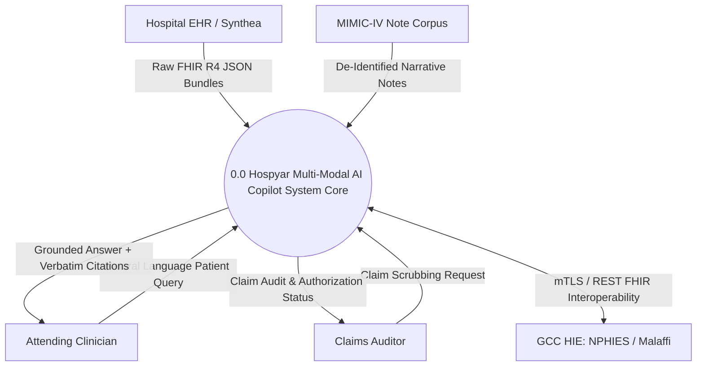
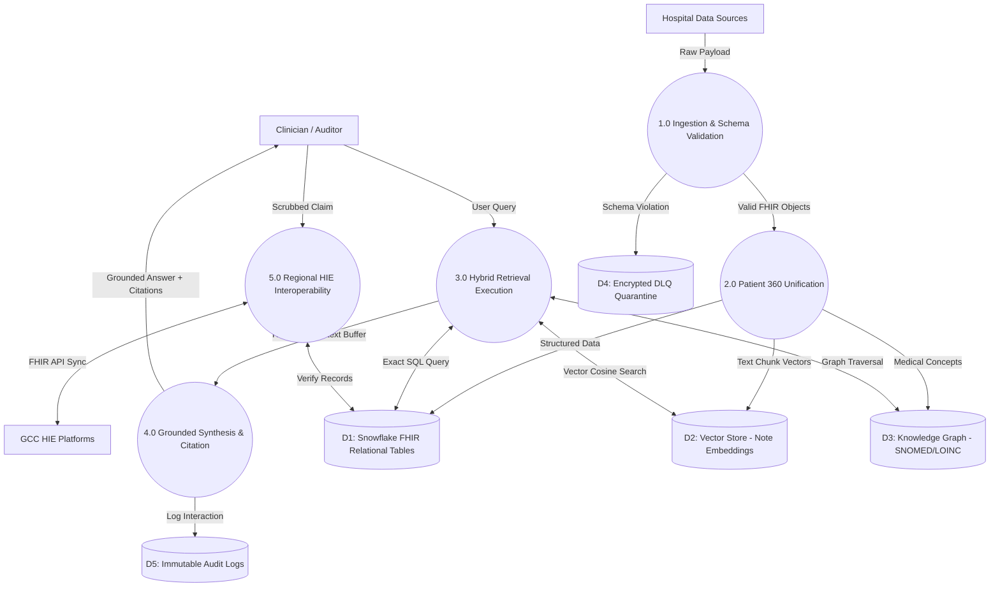
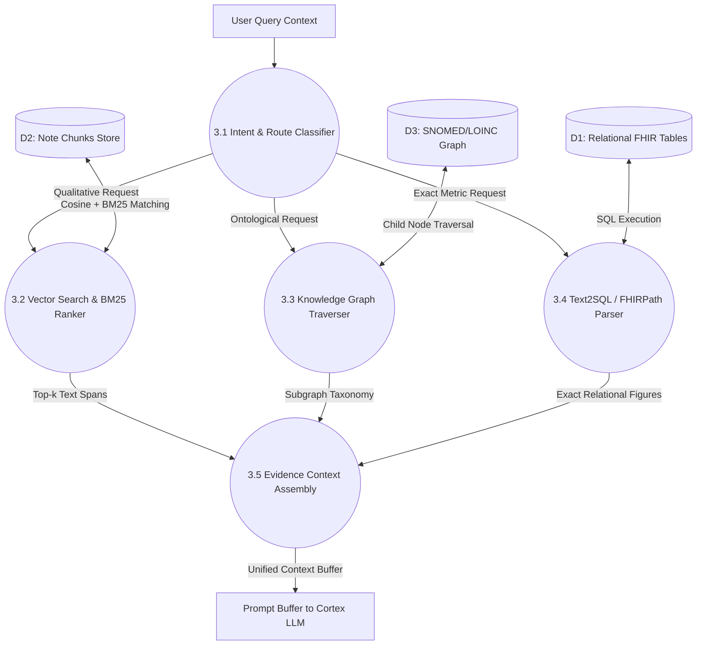

# Data Flow Diagram (DFD) Specification: Hospyar AI Copilot

**System Name:** Hospyar Multi-Modal Hybrid Retrieval Copilot  
**Target Domain:** Enterprise Patient & Member 360, GCC Healthcare Governance  
**Version:** 1.0.0-PROD  
**Document Status:** Complete Multi-Level Data Flow Specification  

---

## 1. Level 0 DFD: System Context Diagram

The Level 0 Context Diagram establishes the global boundary of the Hospyar platform, identifying external data producers and consumers interacting with the system core.

---

## 2. Level 1 DFD: Major Processing Subsystems

Decomposes process `0.0` into five core data transformation modules:

---

## 3. Level 2 DFD: Detailed Breakdown of Subsystem 3.0 (Hybrid Retrieval)

Detailed data transformations inside the **Deterministic Hybrid Retrieval Subsystem**:

---
*Grounded in Multi-Modal Pipeline, FHIR ETL, and HybridRAG Architectural Specs [1, 2, 5, 8, 11, 13].*
