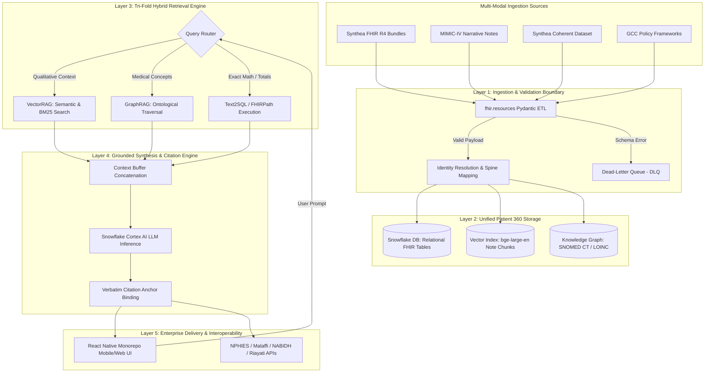

# High-Level Design (HLD) Document: Hospyar Multi-Modal AI Copilot

**System Name:** Hospyar Multi-Modal Hybrid Retrieval Copilot  
**Target Domain:** Enterprise Patient & Member 360, GCC Healthcare Governance  
**Version:** 1.0.0-PROD  
**Document Status:** Approved Architecture  

---

## 1. Executive Summary & Big Picture Architecture

Healthcare organizations in the Gulf Cooperation Council (GCC) region operate across fragmented data landscapes. Structured Fast Healthcare Interoperability Resources (FHIR) bundles, laboratory vitals, and billing claims reside in relational databases, while critical diagnostic narratives, discharge summaries, and radiology reports sit trapped in unstructured text repositories [1, 2, 3]. 

**Hospyar** is an enterprise-grade multi-modal AI copilot engineered to eliminate these data silos. It unifies heterogeneous structured records, clinical narratives, and regional healthcare governance frameworks into a real-time **Patient and Member 360 profile** [1, 3, 5]. Operating upon a **Deterministic Hybrid Retrieval Engine (VectorRAG + GraphRAG + Text2SQL/FHIRPath)**, Hospyar guarantees that every generated decision-support metric, risk score, and natural language response is programmatically bound to immutable, verbatim source citation anchors [2, 6, 8].

---

## 2. Core Architectural Subsystems

### 2.1 Multi-Modal Data Ingestion & Validation Boundary
* **Contract-Driven Ingestion:** Ingests raw JSON payloads using `fhir.resources` Pydantic v2 validation models. Non-compliant records are routed to an encrypted Quarantine/DLQ with SHA-256 payload hashes [11].
* **Universal Primary Identifier Spine:** Resolves synthetic patient records (`subject_id` or `patient_id`) and hospital encounters (`hadm_id` or `encounter_id`) into a universal entity spine [2, 20].

### 2.2 Unified Patient & Member 360 Domain Layer
* **Longitudinal Temporal Synchronization:** Decomposes free-text progress notes into tokenized chunks, computing relative integer time offsets $\Delta t = t_{event} - t_{admission}$ to align unstructured narratives directly with structured lab events and vitals [2].

### 2.3 Deterministic Hybrid Retrieval Subsystem (HybridRAG)
1. **VectorRAG Route:** Partitions clinical notes into sliding windows, calculating hybrid BM25 lexical term weighting and dense vector cosine similarity via `bge-large-en` embeddings [2].
2. **GraphRAG Route:** Traverses SNOMED CT, LOINC, and ICD-10 knowledge graphs to expand parent-child sub-type hierarchies without semantic drift [13].
3. **Text2SQL / FHIRPath Route:** Translates natural language requests regarding exact numbers, vitals, or billing totals into executable SQL or FHIRPath queries against Snowflake tables, guaranteeing zero generative math errors [5, 12].

### 2.4 Verbatim Citation Engine
* Programmatically attaches inline citation anchors to every output assertion, referencing FHIR JSON Pointers (`[Observation/obs-89102#valueQuantity]`), SQL primary keys (`[claims_ledger/claim-4401#denial_code]`), or verbatim note spans (`[Discharge_Summary/note-22104#span_120-145]`) [2, 8, 9].

---

## 3. GCC Governance & Regional Interoperability Alignment

Hospyar natively interfaces with regional Health Information Exchanges (HIEs) and satisfies strict data residency mandates [3, 4, 5]:
* **Saudi Arabia NPHIES:** Validates claim submissions and clinical necessity against doctor notes before FHIR API transmission [3, 4].
* **UAE Malaffi, NABIDH & Riayati:** Exposes bi-directional RESTful FHIR APIs for real-time record synchronization across emirates [4, 5, 14, 15].
* **Sovereign Cloud Compliance:** Deployed entirely inside in-country Virtual Private Clouds (VPCs) under UAE PDPL (Federal Decree-Law No. 45) and Saudi PDPL, with zero data egress [4, 14].

---
*Grounded in Hospyar Architecture Blueprint & GCC Governance Specifications [1, 2, 3, 4, 5, 8, 11, 13].*
