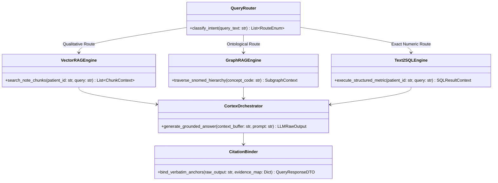

# Low-Level Design (LLD) Document: Hospyar Multi-Modal AI Copilot

**System Name:** Hospyar Multi-Modal Hybrid Retrieval Copilot  
**Target Domain:** Enterprise Patient & Member 360, GCC Healthcare Governance  
**Version:** 1.0.0-PROD  
**Document Status:** Detailed Engineering Specification  

---

## 1. Subsystem Directory & Module Structure

```text
apps/backend/
├── app/
│   ├── main.py                     # FastAPI application factory & middleware
│   ├── core/
│   │   ├── config.py               # Environment variables & CoCo CLI connection settings
│   │   ├── database.py             # Snowflake connection pool & session manager
│   │   └── security.py             # RBAC JWT validation & audit logger
│   ├── pipelines/
│   │   ├── fhir_parser.py          # fhir.resources Pydantic v2 ETL pipeline
│   │   ├── temporal_aligner.py    # Relative time offset calculator (Delta t)
│   │   └── dlq_quarantine.py       # Encrypted DLQ & exception handler
│   ├── retrieval/
│   │   ├── vector_rag.py           # bge-large-en embedding & BM25 ranker
│   │   ├── graph_rag.py            # NetworkX SNOMED CT / LOINC graph traverser
│   │   ├── text2sql.py             # Natural language to SQL translator
│   │   └── router.py               # Tri-fold intent classifier & query router
│   ├── copilot/
│   │   ├── prompt_templates.py     # Grounded system prompts with citation rules
│   │   ├── cortex_orchestrator.py  # Snowflake Cortex AI LLM invocation
│   │   └── citation_binder.py      # Verbatim anchor parser & proof verifier
│   └── api/
│       ├── v1/
│       │   ├── patient360.py       # Patient 360 aggregate endpoints
│       │   ├── copilot.py          # HybridRAG Q&A query endpoints
│       │   └── claims_audit.py     # NPHIES / Malaffi claims scrubber
```

---

## 2. Pydantic DTOs & Data Contracts

```python
from pydantic import BaseModel, Field
from typing import List, Optional, Dict, Any
from datetime import datetime

class CitationAnchorDTO(BaseModel):
    citation_id: str = Field(..., description="Unique citation key e.g., CIT-001")
    pointer_type: str = Field(..., description="FHIR_POINTER | SQL_KEY | TEXT_SPAN")
    source_reference: str = Field(..., description="e.g., Observation/obs-89102#valueQuantity")
    verbatim_text: str = Field(..., description="Exact quoted text span or value from source")

class QueryRequestDTO(BaseModel):
    patient_id: str = Field(..., description="Universal patient identifier spine")
    query_text: str = Field(..., description="User query in English or Arabic")
    user_role: str = Field(..., description="CLINICIAN | CLAIMS_AUDITOR | SYSTEM_ADMIN")
    locale: str = Field("en-US", description="en-US or ar-SA for RTL layout")

class QueryResponseDTO(BaseModel):
    patient_id: str
    generated_answer: str = Field(..., description="Grounded response containing inline anchors [CIT-xxx]")
    citations: List[CitationAnchorDTO]
    retrieval_routes_used: List[str] = Field(..., description="['VectorRAG', 'GraphRAG', 'Text2SQL']")
    execution_time_ms: float
    confidence_score: float
```

---

## 3. Snowflake Relational Database Schema (SQL DDL)

```sql
-- Patients Core Spine Table
CREATE TABLE IF NOT EXISTS PATIENT_360_HEADER (
    PATIENT_ID VARCHAR(64) PRIMARY KEY,
    NATIONAL_ID_HASH VARCHAR(128) NOT NULL,
    GENDER VARCHAR(10),
    BIRTH_DATE DATE,
    BLOOD_TYPE VARCHAR(5),
    PRIMARY_LANGUAGE VARCHAR(10),
    REGIONAL_HIE_ID VARCHAR(64), -- Malaffi/NPHIES Mapping Key
    CREATED_AT TIMESTAMP_NTZ DEFAULT CURRENT_TIMESTAMP()
);

-- Structured FHIR Observations Table
CREATE TABLE IF NOT EXISTS CLINICAL_OBSERVATIONS (
    OBSERVATION_ID VARCHAR(64) PRIMARY KEY,
    PATIENT_ID VARCHAR(64) FOREIGN KEY REFERENCES PATIENT_360_HEADER(PATIENT_ID),
    ENCOUNTER_ID VARCHAR(64),
    LOINC_CODE VARCHAR(32) NOT NULL,
    LOINC_DISPLAY VARCHAR(255),
    NUMERIC_VALUE NUMBER(12,4),
    VALUE_UNIT VARCHAR(32),
    OBSERVATION_TIMESTAMP TIMESTAMP_NTZ NOT NULL,
    FHIR_RESOURCE_PATH VARCHAR(255) -- Pointer for citation anchor
);

-- Unstructured Clinical Note Chunks & Vector Metadata
CREATE TABLE IF NOT EXISTS NOTE_CHUNKS_VECTOR_STORE (
    CHUNK_ID VARCHAR(64) PRIMARY KEY,
    NOTE_ID VARCHAR(64) NOT NULL,
    PATIENT_ID VARCHAR(64) FOREIGN KEY REFERENCES PATIENT_360_HEADER(PATIENT_ID),
    HADM_ID VARCHAR(64),
    SECTION_HEADER VARCHAR(128), -- e.g., 'History of Present Illness'
    VERBATIM_TEXT VARCHAR(4000) NOT NULL,
    RELATIVE_OFFSET_HOURS INT, -- Delta t relative to admission
    NOTE_SPAN_POINTER VARCHAR(255), -- e.g., Discharge_Summary/note-22104#span_120-145
    VECTOR_EMBEDDING VECTOR(FLOAT, 768) -- bge-large-en 768-dim vector
);
```

---

## 4. Class & Interaction Architecture



---
*Grounded in fhir.resources Python ETL, Snowflake Cortex AI, and HybridRAG specifications [2, 5, 8, 11, 13].*
