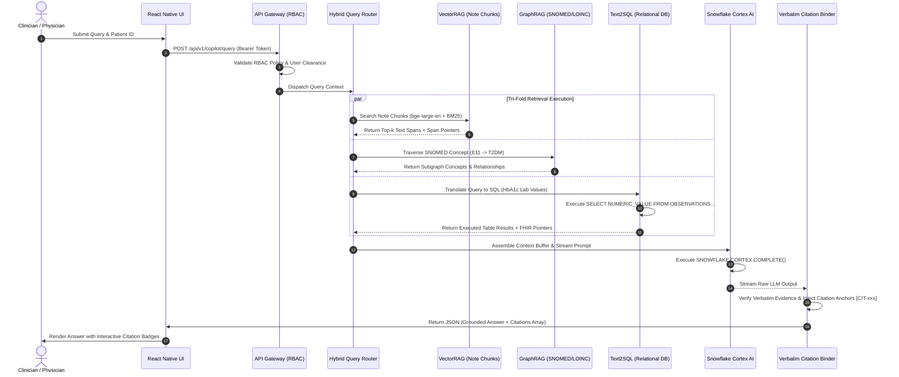
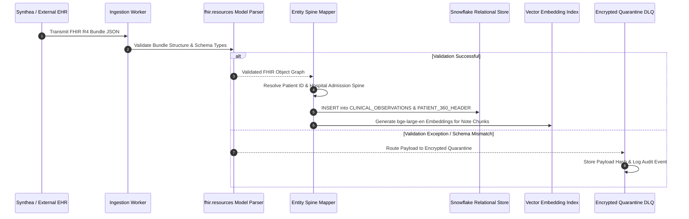
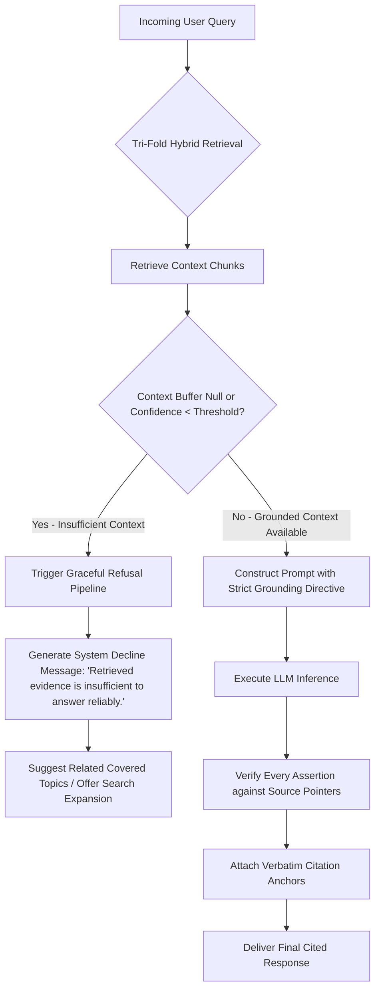

# Sequence & Flow Charts Specification: Hospyar AI Copilot

**System Name:** Hospyar Multi-Modal Hybrid Retrieval Copilot  
**Target Domain:** Enterprise Patient & Member 360, GCC Healthcare Governance  
**Version:** 1.0.0-PROD  
**Document Status:** Detailed Workflow & Chronological Interaction Spec  

---

## 1. Sequence Diagram 1: End-to-End HybridRAG Query & Citation Binding

Traces the execution path when a clinician asks: *"What is the patient's HbA1c trend and latest clinical assessment for diabetes control?"*

---

## 2. Sequence Diagram 2: FHIR ETL Pipeline & DLQ Routing

Traces how incoming FHIR R4 bundles are validated via `fhir.resources` and indexed or quarantined:

---

## 3. Flowchart 1: Fallback Logic & Insufficient Context Refusal

Ensures Hospyar explicitly declines to answer when retrieved evidence is absent, preventing hallucinations [6, 7]:

---
*Grounded in HybridRAG and Grounded Q&A Citation Engineering Protocols [2, 6, 7, 8, 11].*
