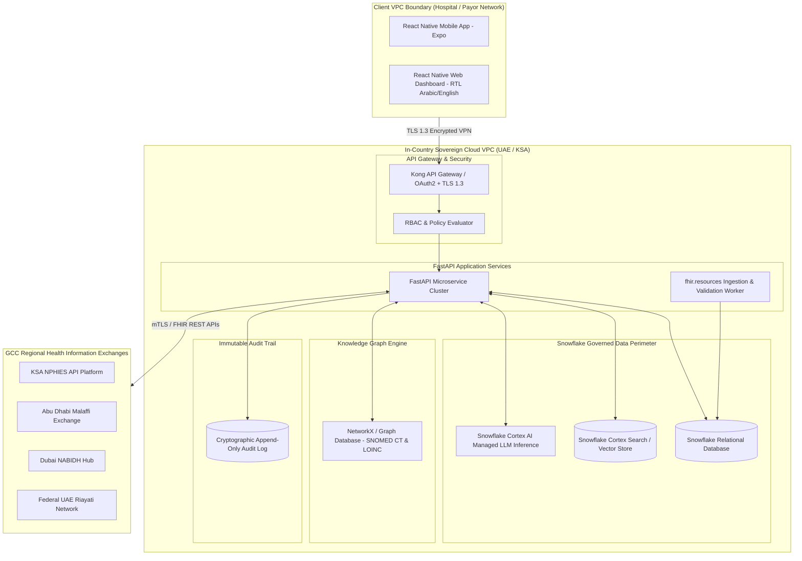

# System Architecture Blueprint: Hospyar Sovereign AI Copilot

**System Name:** Hospyar Multi-Modal Hybrid Retrieval Copilot  
**Target Domain:** Enterprise Patient & Member 360, GCC Healthcare Governance  
**Version:** 1.0.0-PROD  
**Document Status:** Cloud & Infrastructure Security Specification  

---

## 1. Sovereign Cloud Deployment Topology

To comply strictly with GCC data residency mandates—specifically **UAE Personal Data Protection Law (Federal Decree-Law No. 45)** and **Saudi Arabia Personal Data Protection Law (KSA PDPL)**—Hospyar is architected for zero cross-border data egress [4, 5, 14, 15]. All compute nodes, vector stores, knowledge graph instances, and LLM inference engines run physically within in-country sovereign cloud availability zones.

---

## 2. Snowflake Ecosystem Integration & CoCo CLI

Hospyar builds upon the **Snowflake CoCo CLI** developer ecosystem to establish native connection hooks between application code and Snowflake's governed data boundary:

* **Workspace Configuration (`coco_config.yaml`):** Defines the compute warehouse, target database (`HOSPYAR_PATIENT360_DB`), schema (`PUBLIC`), and role-based clearance permissions (`ROLE = HOSPYAR_CLINICAL_ROLE`).
* **Snowflake Cortex AI:** Managed, in-database LLM inference via `SNOWFLAKE.CORTEX.COMPLETE('llama3-70b', prompt)`. Keeps clinical prompt buffers within the Snowflake data perimeter, avoiding external API calls or third-party egress.
* **Snowpark Python Engines:** Runs heavy multi-modal vector similarity calculations and tabular transformations inside Snowflake's isolated sandbox compute nodes.

---

## 3. Technology Stack Alignment Matrix

| Architectural Layer | Core Framework / Tooling | Justification & Compliance Function |
| :--- | :--- | :--- |
| **Frontend UI** | React Native (Expo) + React Native for Web | Cross-platform (iOS, Android, Web) monorepo delivery with native Right-to-Left (RTL) Arabic layout rendering [23]. |
| **Backend API Layer** | Python 3.12 + FastAPI + Pydantic v2 | High-performance asynchronous API framework enforcing contract-driven data validation [11]. |
| **Data Ingestion ETL** | `fhir.resources` Python Library | Native Pydantic v2-backed HL7 FHIR R4 schema parser enforcing structural integrity [11]. |
| **Relational Data Cloud** | Snowflake Data Cloud | Governed, scalable data storage holding relational FHIR tables and transactional logs [3, 9]. |
| **Managed LLM Inference** | Snowflake Cortex AI | Zero-egress LLM execution within local sovereign cloud boundaries [4, 14]. |
| **Vector Embedding Model** | `bge-large-en` / `Bio_ClinicalBERT` | Fine-tuned 768-dimensional medical sentence transformer for clinical narrative chunking [2, 19]. |
| **Knowledge Graph Engine** | NetworkX / SNOMED CT & LOINC Triplet Store | Ontological concept traversal and synonym resolution without semantic drift [13, 14]. |

---

## 4. Security, Access Control & Auditability

1. **Role-Based Access Control (RBAC):** Restricts vector search and SQL execution visibility based on user clearance:
   * **Clinician Role:** Accesses full SOAP narratives, lab trends, and medical history.
   * **Claims Auditor Role:** Accesses financial ledgers, billing codes, and claim authorization status.
2. **Cryptographic Append-Only Audit Logging:** Writes every query, retrieved text span, generated response, and citation anchor to an immutable log table for DHA, HAAD, and SFDA regulatory inspection [14, 23].

---
*Grounded in UAE PDPL, Saudi Arabia PDPL, ADHICS, and Snowflake Sovereign Cloud Standards [3, 4, 5, 11, 14, 15, 23].*
