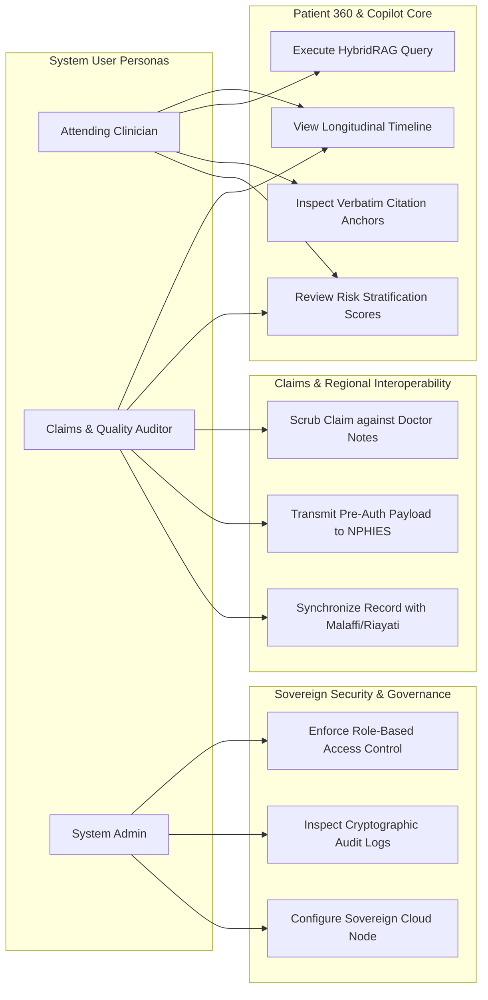

# Use Case & User Diagram Specification: Hospyar AI Copilot

**System Name:** Hospyar Multi-Modal Hybrid Retrieval Copilot  
**Target Domain:** Enterprise Patient & Member 360, GCC Healthcare Governance  
**Version:** 1.0.0-PROD  
**Document Status:** Persona, Access Control & Functional Interaction Spec  

---

## 1. User Persona Profiles

### Persona 1: Attending Clinician / Physician
* **Primary Objective:** Review longitudinal patient histories, cross-reference diagnostic vitals with progress notes, and evaluate risk stratification before clinical rounds.
* **Key Tasks:** Search Patient 360 timeline, query lab trends via HybridRAG, inspect verbatim citation note spans [2].

### Persona 2: Insurance Claims & Quality Auditor
* **Primary Objective:** Scrub billing claims against clinical documentation before submission to regional HIE platforms (NPHIES, Malaffi) to prevent denial [3, 4].
* **Key Tasks:** Verify diagnosis-procedure coding consistency, review prior authorization justifications, audit financial ledgers.

### Persona 3: Healthcare IT & Compliance Administrator
* **Primary Objective:** Enforce GCC data sovereignty mandates (UAE/KSA PDPL), manage user RBAC permissions, and inspect immutable audit trails [4, 5, 14].
* **Key Tasks:** Manage user roles, inspect cryptographic access logs, configure HIE endpoint connections.

---

## 2. Functional Use Case Diagram

---

## 3. Role-Based Access Control (RBAC) Clearance Matrix

| Functional Resource / Data Target | Attending Clinician | Claims & Quality Auditor | System Administrator |
| :--- | :--- | :--- | :--- |
| **Unstructured SOAP Notes & Progress Summaries** | **Full Access** (Read) | **Scoped Access** (Read anonymized) | No Access (Metadata only) |
| **Structured Vitals & Lab Observations** | **Full Access** (Read) | **Full Access** (Read) | No Access (Metadata only) |
| **Payer Ledgers & Financial Claims** | Restricted | **Full Access** (Read/Write) | No Access |
| **HybridRAG Q&A Copilot Engine** | **Full Access** | **Full Access** (Audit mode) | System Diagnostics Only |
| **NPHIES / Malaffi Submission Trigger** | Read Only | **Full Access** (Execute) | Endpoint Config Only |
| **Cryptographic Append-Only Audit Logs** | View Personal Logs | View Department Logs | **Full System Access** (Read) |

---

## 4. Bilingual RTL/LTR Interface Layout Specifications

Operating within GCC hospital workflows requires seamless support for multi-lingual clinical teams [23]:
* **Dynamic Layout Engine:** React Native UI automatically flips layout containers between **Right-to-Left (RTL)** for Arabic interfaces and **Left-to-Right (LTR)** for English.
* **Preservation of Embedded Terminology:** Medical coding terms (SNOMED CT, LOINC, ICD-10), numerical vitals (e.g., `HbA1c: 7.2%`), and verbatim citation badges (`[Observation/obs-89102#valueQuantity]`) maintain strict LTR orientation inside Arabic text blocks to prevent formatting confusion [23].

---
*Grounded in GCC Healthcare Governance, NPHIES, Malaffi, and UI Localization Standards [2, 3, 4, 5, 14, 23].*
