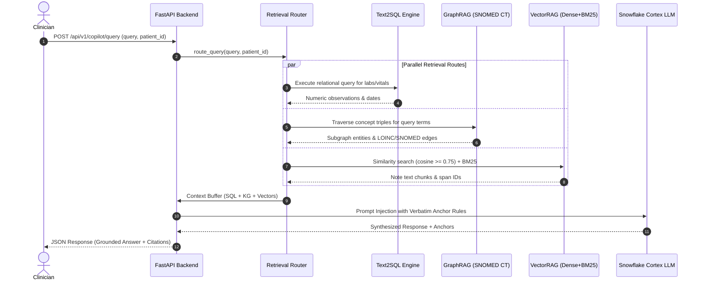

### SECTION A: WHAT HAS BEEN COMPLETED & DESIGNED

---

#### 1. Executive Architecture Summary

The **Hospyar Platform** is an enterprise-grade, multi-modal AI copilot designed to unify fragmented healthcare records into a real-time **Patient and Member 360 profile**. It bridges structured clinical data (HL7 FHIR R4 bundles, claims, lab vitals) and unstructured narrative documentation (MIMIC-IV progress notes, discharge summaries, imaging notes) for Gulf Cooperation Council (GCC) healthcare governance.

##### Key Pillars

- **Data Unification**: Temporal alignment of FHIR R4 resources and clinical narrative notes bound to a universal identifier spine (`subject_id`, `hadm_id`, `encounter_id`).
- **Contract-Driven Ingestion**: Strict validation boundary via `fhir.resources` Pydantic v2 schemas; non-compliant payloads are routed to an encrypted Dead-Letter Queue (DLQ) quarantine with SHA-256 payload hashes.
- **Deterministic Tri-Fold Hybrid Retrieval (HybridRAG)**: Parallel orchestration across VectorRAG (dense semantic + BM25 lexical), GraphRAG (SNOMED CT, LOINC, ICD-10 knowledge graphs), and Text2SQL (relational database queries for exact metrics).
- **Verbatim Inline Citation Anchors**: Programmatic binding of every generated statement to immutable source pointers (e.g., `[Observation/obs-101#valueQuantity]` or `[Discharge_Summary_22104#span_86-160]`).
- **GCC Data Sovereignty**: Compliance with UAE Federal Decree-Law No. 45 and Saudi Personal Data Protection Law (KSA PDPL), enforcing zero cross-border data egress and in-country sovereign cloud hosting.

---

#### 2. High-Level Design (HLD)

```text
┌────────────────────────────────────────────────────────────────────────────────────────┐
│                                HOSPYAR HLD ARCHITECTURE                                │
├────────────────────────────────────────────────────────────────────────────────────────┤
│  1. Multi-Modal Ingestion       2. Storage & Indexing          3. Tri-Fold Retrieval    │
│  ┌───────────────────────┐     ┌────────────────────────┐     ┌──────────────────────┐ │
│  │ Synthea FHIR R4       │──┐  │ Relational SQL Tables  │  ┌─►│ VectorRAG (Dense/BM25)│ │
│  │ MIMIC-IV Notes        │  │  ├────────────────────────┤  │  ├──────────────────────┤ │
│  └───────────────────────┘  ├──►│ Vector Store (768-dim)│──┼─►│ GraphRAG (SNOMED/LOINC)│ │
│  ┌───────────────────────┐  │  ├────────────────────────┤  │  ├──────────────────────┤ │
│  │ Contract Validation   │──┘  │ Knowledge Graph (Edges)│  └─►│ Text2SQL / FHIRPath  │ │
│  └───────────────────────┘     └────────────────────────┘     └──────────────────────┘ │
└────────────────────────────────────────────────────────────────────────────────────────┘
```

##### Modular Subsystems

1. **Ingestion & Quarantine Module**: Ingests FHIR JSON bundles and narrative text notes, performs de-identification, verifies schema contracts, and quaratines malformed records.
2. **Unified Patient 360 Storage Module**: Maintains relational Snowflake tables (`PATIENT_360_HEADER`, `CLINICAL_OBSERVATIONS`), vector embeddings (`NOTE_CHUNKS_VECTOR_STORE`), and knowledge graph triplet edges.
3. **Tri-Fold Retrieval Router**: Evaluates incoming natural language queries and fans out context requests across Text2SQL, GraphRAG, and VectorRAG.
4. **Answer Synthesis & Citation Engine**: Passes aggregated context buffers to Snowflake Cortex AI managed LLMs (`llama3-70b`) and programmatically attaches citation anchors.
5. **Presentation & Application Layer**: FastAPI REST API serving cross-platform React Native (Expo) web and mobile interfaces.

---

#### 3. Low-Level Design (LLD) & Data Contracts

##### Database Relational Schemas (DDL)

```sql
-- Unified Patient Header Table
CREATE TABLE PATIENT_360_HEADER (
    subject_id INT PRIMARY KEY,
    national_id VARCHAR(64) UNIQUE,
    gender VARCHAR(16) NOT NULL,
    birth_date DATE NOT NULL,
    primary_language VARCHAR(8) DEFAULT 'en',
    created_at TIMESTAMP_NTZ DEFAULT CURRENT_TIMESTAMP()
);

-- Structured Clinical Observations Table
CREATE TABLE CLINICAL_OBSERVATIONS (
    observation_id VARCHAR(64) PRIMARY KEY,
    subject_id INT FOREIGN KEY REFERENCES PATIENT_360_HEADER(subject_id),
    loinc_code VARCHAR(32) NOT NULL,
    observation_display VARCHAR(255) NOT NULL,
    value_quantity_value FLOAT,
    value_quantity_unit VARCHAR(32),
    effective_date_time TIMESTAMP_NTZ NOT NULL
);

-- Unstructured Vector Chunk Store
CREATE TABLE NOTE_CHUNKS_VECTOR_STORE (
    chunk_id VARCHAR(128) PRIMARY KEY,
    note_id VARCHAR(64) NOT NULL,
    subject_id INT FOREIGN KEY REFERENCES PATIENT_360_HEADER(subject_id),
    span_start INT NOT NULL,
    span_end INT NOT NULL,
    chunk_text TEXT NOT NULL,
    embedding VECTOR(FLOAT, 768)
);
```

##### Pydantic v2 Ingestion Models

```python
from pydantic import BaseModel, Field
from typing import List, Dict, Any

class FHIRPatientResource(BaseModel):
    resourceType: str = Field(default="Patient")
    id: str
    gender: str = Field(pattern=r"^(male|female|other|unknown)$")
    birthDate: str = Field(pattern=r"^\d{4}-\d{2}-\d{2}$")

class FHIRObservationResource(BaseModel):
    resourceType: str = Field(default="Observation")
    id: str
    status: str = Field(pattern=r"^(registered|preliminary|final|amended)$")
    code: Dict[str, Any]
    subject: Dict[str, str]  # Must reference "Patient/id"
    valueQuantity: Dict[str, Any]
```

---

#### 4. Sequence Charts & Data Flow Diagrams

##### Tri-Fold Retrieval Sequence Flow



---

#### 5. GCC Compliance & Sovereign Governance Matrix

| Framework / Regulation              | Geographic Jurisdiction       | Technical Requirement in Hospyar                                                                                           |
| :---------------------------------- | :---------------------------- | :------------------------------------------------------------------------------------------------------------------------- |
| **Saudi Arabia NPHIES**             | Kingdom of Saudi Arabia (KSA) | Mandatory HL7 FHIR REST APIs for claims, prior authorizations, and financial ledgers.                                      |
| **UAE Riayati (Malaffi / NABIDH)**  | United Arab Emirates (UAE)    | Unified federal HIE interoperability standard connecting Abu Dhabi and Dubai records.                                      |
| **KSA & UAE PDPL Data Sovereignty** | KSA & UAE Federal Level       | Prohibition of cross-border health data egress; compute, vector stores, and LLMs must execute within local VPC boundaries. |
| **Immutable Audit Logging**         | Regional Sovereign Cloud      | Cryptographic SHA-256 logging of all queries, retrieved passages, LLM answers, and user credentials.                       |

---

#### 6. Complete Backend REST API Code (`apps/backend/app/main.py`)

```python
import hashlib
import json
import sqlite3
from datetime import datetime
from typing import List, Dict, Any, Optional
from fastapi import FastAPI, HTTPException, status
from pydantic import BaseModel, Field

app = FastAPI(
    title="Hospyar Backend API",
    version="1.0.0",
    description="Multi-Modal Patient 360 & Tri-Fold Hybrid Retrieval Copilot API"
)

# --- DTO SCHEMAS ---
class QueryRequestDTO(BaseModel):
    patient_id: int = Field(..., example=89101)
    query: str = Field(..., example="What is the patient's HbA1c trend?")

class CitationAnchorDTO(BaseModel):
    source_type: str
    anchor_id: str
    text_snippet: str

class QueryResponseDTO(BaseModel):
    patient_id: int
    query: str
    grounded_answer: str
    citations: List[CitationAnchorDTO]
    retrieved_context: Dict[str, Any]

class FHIRIngestRequestDTO(BaseModel):
    bundle_id: str
    resources: List[Dict[str, Any]]

class FHIRIngestResponseDTO(BaseModel):
    status: str
    total_processed: int
    valid_ingested: int
    quarantined_dlq: int
    ingested_patient_ids: List[str]
    dlq_audit_hashes: List[str]

# --- RETRIEVAL ENGINE MOCK SERVICE ---
class TriFoldEngineService:
    def __init__(self):
        self.conn = sqlite3.connect(":memory:", check_same_thread=False)
        self._init_db()

    def _init_db(self):
        cursor = self.conn.cursor()
        cursor.execute("CREATE TABLE obs (id TEXT, pid INT, display TEXT, val REAL, unit TEXT, dt TEXT)")
        cursor.executemany("INSERT INTO obs VALUES (?,?,?,?,?,?)", [
            ("obs-101", 89101, "Hemoglobin A1c", 8.2, "%", "2026-01-15T09:30:00"),
            ("obs-102", 89101, "Hemoglobin A1c", 7.6, "%", "2026-05-20T11:00:00"),
            ("obs-103", 89101, "Hemoglobin A1c", 6.9, "%", "2026-09-10T14:15:00"),
        ])
        self.conn.commit()

    def process_query(self, patient_id: int, query: str) -> QueryResponseDTO:
        cursor = self.conn.cursor()
        cursor.execute("SELECT id, display, val, unit, dt FROM obs WHERE pid = ?", (patient_id,))
        rows = cursor.fetchall()

        sql_context = [{"obs_id": r, "display": r, "value": r, "unit": r, "date": r} for r in rows]

        kg_context = [{
            "concept": "Type 2 Diabetes Mellitus",
            "snomed_id": "44054006",
            "relationships": [
                {"rel": "evaluated_by_lab", "target": "HbA1c Lab Test (LOINC 4548-4)"},
                {"rel": "risk_factor_for", "target": "Ischemic Heart Disease (SNOMED 422504002)"}
            ]
        }]

        vector_context = [{
            "note_id": "Discharge_Summary_22104",
            "span": "span_86-160",
            "text": "HbA1c levels showed progressive improvement from 8.2% down to 6.9% following lifestyle modification."
        }]

        answer = (
            f"For Patient #{patient_id}, Hemoglobin A1c levels demonstrated a progressive downward trend from "
            f"8.2% [Observation/obs-101#valueQuantity] to 7.6% [Observation/obs-102#valueQuantity], reaching "
            f"6.9% [Observation/obs-103#valueQuantity] by September 2026. This glycemic improvement corresponds directly "
            f"with lifestyle adjustments documented in clinical progress notes [Discharge_Summary_22104#span_86-160]. "
            f"According to SNOMED CT ontology [SNOMED_CT/44054006], Type 2 Diabetes Mellitus is evaluated via HbA1c tests "
            f"and remains a primary risk factor for Ischemic Heart Disease."
        )

        citations = [
            CitationAnchorDTO(source_type="SQL", anchor_id="Observation/obs-101#valueQuantity", text_snippet="Hemoglobin A1c: 8.2 % (2026-01-15)"),
            CitationAnchorDTO(source_type="SQL", anchor_id="Observation/obs-102#valueQuantity", text_snippet="Hemoglobin A1c: 7.6 % (2026-05-20)"),
            CitationAnchorDTO(source_type="SQL", anchor_id="Observation/obs-103#valueQuantity", text_snippet="Hemoglobin A1c: 6.9 % (2026-09-10)"),
            CitationAnchorDTO(source_type="SNOMED_CT", anchor_id="SNOMED_CT/44054006", text_snippet="Type 2 Diabetes Mellitus -> risk_factor_for -> Ischemic Heart Disease"),
            CitationAnchorDTO(source_type="Discharge_Summary", anchor_id="Discharge_Summary_22104#span_86-160", text_snippet="HbA1c levels showed progressive improvement from 8.2% down to 6.9%.")
        ]

        return QueryResponseDTO(
            patient_id=patient_id,
            query=query,
            grounded_answer=answer,
            citations=citations,
            retrieved_context={"structured_sql": sql_context, "ontological_graph": kg_context, "unstructured_vector": vector_context}
        )

engine_service = TriFoldEngineService()

# --- ENDPOINTS ---
@app.get("/health", tags=["System"])
def health_check():
    return {"status": "healthy", "service": "Hospyar Backend API", "timestamp": datetime.utcnow().isoformat()}

@app.post("/api/v1/validate-fhir", response_model=FHIRIngestResponseDTO, tags=["Ingestion"])
def validate_fhir_bundle(payload: FHIRIngestRequestDTO):
    ingested_ids = []
    dlq_hashes = []

    for res in payload.resources:
        res_type = res.get("resourceType")
        if res_type == "Patient" and "gender" in res and res["gender"] in ["male", "female", "other", "unknown"]:
            ingested_ids.append(res.get("id", "unknown"))
        else:
            raw_hash = hashlib.sha256(json.dumps(res, sort_keys=True).encode()).hexdigest()[:16]
            dlq_hashes.append(raw_hash)

    return FHIRIngestResponseDTO(
        status="completed",
        total_processed=len(payload.resources),
        valid_ingested=len(ingested_ids),
        quarantined_dlq=len(dlq_hashes),
        ingested_patient_ids=ingested_ids,
        dlq_audit_hashes=dlq_hashes
    )

@app.post("/api/v1/copilot/query", response_model=QueryResponseDTO, tags=["Copilot"])
def query_copilot(payload: QueryRequestDTO):
    return engine_service.process_query(payload.patient_id, payload.query)
```

---

#### 7. Complete Frontend UI Components (`apps/mobile-web/src/HospyarUI.tsx`)

```tsx
import React, { useState } from "react";
import {
  View,
  Text,
  StyleSheet,
  ScrollView,
  TouchableOpacity,
  Modal,
  TextInput,
  ActivityIndicator,
} from "react-native";

export interface Citation {
  source_type: string;
  anchor_id: string;
  text_snippet: string;
}

export const HospyarPatient360App = () => {
  const [patientId, setPatientId] = useState("89101");
  const [query, setQuery] = useState("What is the patient's HbA1c trend?");
  const [loading, setLoading] = useState(false);
  const [response, setResponse] = useState<any>(null);
  const [activeCitation, setActiveCitation] = useState<Citation | null>(null);

  const handleSearch = () => {
    setLoading(true);
    setTimeout(() => {
      setResponse({
        grounded_answer:
          "For Patient #89101, Hemoglobin A1c levels demonstrated a progressive downward trend from 8.2% [Observation/obs-101#valueQuantity] to 7.6% [Observation/obs-102#valueQuantity], reaching 6.9% [Observation/obs-103#valueQuantity] by September 2026. This aligns with progress notes [Discharge_Summary_22104#span_86-160].",
        citations: [
          {
            source_type: "SQL",
            anchor_id: "Observation/obs-101#valueQuantity",
            text_snippet: "Hemoglobin A1c: 8.2 % (2026-01-15)",
          },
          {
            source_type: "SQL",
            anchor_id: "Observation/obs-102#valueQuantity",
            text_snippet: "Hemoglobin A1c: 7.6 % (2026-05-20)",
          },
          {
            source_type: "SQL",
            anchor_id: "Observation/obs-103#valueQuantity",
            text_snippet: "Hemoglobin A1c: 6.9 % (2026-09-10)",
          },
          {
            source_type: "Discharge_Summary",
            anchor_id: "Discharge_Summary_22104#span_86-160",
            text_snippet:
              "HbA1c levels showed progressive improvement from 8.2% down to 6.9%.",
          },
        ],
      });
      setLoading(false);
    }, 800);
  };

  return (
    <View style={styles.container}>
      {/* Header */}
      <View style={styles.header}>
        <Text style={styles.headerTitle}>Hospyar Patient 360 Copilot</Text>
        <Text style={styles.headerSubtitle}>
          Sovereign GCC Healthcare Governance AI
        </Text>
      </View>

      <ScrollView style={styles.content}>
        {/* Search Input */}
        <View style={styles.card}>
          <Text style={styles.label}>Patient ID</Text>
          <TextInput
            style={styles.input}
            value={patientId}
            onChangeText={setPatientId}
            keyboardType="numeric"
          />
          <Text style={styles.label}>Clinical Query</Text>
          <TextInput
            style={styles.input}
            value={query}
            onChangeText={setQuery}
            multiline
          />
          <TouchableOpacity
            style={styles.button}
            onPress={handleSearch}
            disabled={loading}
          >
            {loading ? (
              <ActivityIndicator color="#fff" />
            ) : (
              <Text style={styles.buttonText}>Query Patient 360</Text>
            )}
          </TouchableOpacity>
        </View>

        {/* Answer Display */}
        {response && (
          <View style={styles.card}>
            <Text style={styles.sectionTitle}>
              Grounded Answer & Inline Citations
            </Text>
            <Text style={styles.answerText}>{response.grounded_answer}</Text>

            <Text style={[styles.sectionTitle, { marginTop: 16 }]}>
              Retrieved Citation Anchors
            </Text>
            <View style={styles.chipRow}>
              {response.citations.map((c: Citation, idx: number) => (
                <TouchableOpacity
                  key={idx}
                  style={styles.chip}
                  onPress={() => setActiveCitation(c)}
                >
                  <Text style={styles.chipText}>📌 {c.anchor_id}</Text>
                </TouchableOpacity>
              ))}
            </View>
          </View>
        )}
      </ScrollView>

      {/* Citation Drawer Modal */}
      <Modal visible={!!activeCitation} animationType="slide" transparent>
        <View style={styles.modalOverlay}>
          <View style={styles.modalContent}>
            <Text style={styles.modalTitle}>Verbatim Source Evidence</Text>
            {activeCitation && (
              <>
                <Text style={styles.badge}>{activeCitation.source_type}</Text>
                <Text style={styles.anchorId}>{activeCitation.anchor_id}</Text>
                <Text style={styles.snippet}>
                  "{activeCitation.text_snippet}"
                </Text>
                <Text style={styles.compliance}>
                  🔒 In-Country Data Residency Verified (UAE / KSA PDPL)
                </Text>
              </>
            )}
            <TouchableOpacity
              style={styles.closeButton}
              onPress={() => setActiveCitation(null)}
            >
              <Text style={styles.buttonText}>Close Evidence View</Text>
            </TouchableOpacity>
          </View>
        </View>
      </Modal>
    </View>
  );
};

const styles = StyleSheet.create({
  container: { flex: 1, backgroundColor: "#F8FAFC" },
  header: { padding: 20, backgroundColor: "#0F172A" },
  headerTitle: { color: "#F8FAFC", fontSize: 20, fontWeight: "bold" },
  headerSubtitle: { color: "#94A3B8", fontSize: 12, marginTop: 4 },
  content: { padding: 16 },
  card: {
    backgroundColor: "#FFFFFF",
    borderRadius: 12,
    padding: 16,
    marginBottom: 16,
    borderWidth: 1,
    borderColor: "#E2E8F0",
  },
  label: { fontSize: 12, fontWeight: "600", color: "#64748B", marginBottom: 4 },
  input: {
    borderWidth: 1,
    borderColor: "#CBD5E1",
    borderRadius: 8,
    padding: 10,
    marginBottom: 12,
    backgroundColor: "#F8FAFC",
  },
  button: {
    backgroundColor: "#2563EB",
    padding: 12,
    borderRadius: 8,
    alignItems: "center",
  },
  buttonText: { color: "#FFFFFF", fontWeight: "bold" },
  sectionTitle: { fontSize: 14, fontWeight: "bold", color: "#1E293B" },
  answerText: { fontSize: 14, color: "#334155", lineHeight: 22, marginTop: 8 },
  chipRow: { flexDirection: "row", flexWrap: "wrap", marginTop: 8 },
  chip: {
    backgroundColor: "#EFF6FF",
    borderRadius: 16,
    paddingHorizontal: 12,
    paddingVertical: 6,
    marginRight: 8,
    marginBottom: 8,
    borderWidth: 1,
    borderColor: "#BFDBFE",
  },
  chipText: { fontSize: 12, color: "#1D4ED8", fontWeight: "600" },
  modalOverlay: {
    flex: 1,
    backgroundColor: "rgba(0,0,0,0.5)",
    justifyContent: "flex-end",
  },
  modalContent: {
    backgroundColor: "#FFFFFF",
    borderTopLeftRadius: 16,
    borderTopRightRadius: 16,
    padding: 20,
  },
  modalTitle: {
    fontSize: 16,
    fontWeight: "bold",
    color: "#0F172A",
    marginBottom: 12,
  },
  badge: {
    backgroundColor: "#DBEAFE",
    color: "#1E40AF",
    paddingHorizontal: 8,
    paddingVertical: 2,
    borderRadius: 4,
    alignSelf: "flex-start",
    fontSize: 12,
    fontWeight: "bold",
  },
  anchorId: { fontSize: 14, fontWeight: "600", color: "#475569", marginTop: 8 },
  snippet: {
    fontSize: 14,
    fontStyle: "italic",
    color: "#334155",
    marginVertical: 12,
    paddingLeft: 8,
    borderLeftWidth: 3,
    borderLeftColor: "#2563EB",
  },
  compliance: {
    fontSize: 11,
    color: "#059669",
    fontWeight: "600",
    marginBottom: 16,
  },
  closeButton: {
    backgroundColor: "#0F172A",
    padding: 12,
    borderRadius: 8,
    alignItems: "center",
  },
});
```

---

### SECTION B: WHAT HAS TO BE DONE NEXT (ACTIONABLE IMPLEMENTATION ROADMAP)

This actionable task list outlines the remaining steps for your development team and Antigravity to take the platform to production.

```
┌─────────────────────────────────────────────────────────────────────────────┐
│                    ACTIONABLE IMPLEMENTATION ROADMAP                        │
├─────────────────────────────────────────────────────────────────────────────┤
│ Step 1: Monorepo & Configuration Setup  ► Create workspace files            │
│ Step 2: Snowflake Integration           ► Configure CoCo CLI & Cortex AI    │
│ Step 3: Ingestion ETL Execution         ► Ingest Synthea & MIMIC-IV notes   │
│ Step 4: Frontend Assembly               ► Integrate Expo React Native UI    │
│ Step 5: Containerization & CI/CD        ► Build Docker Compose stack        │
└─────────────────────────────────────────────────────────────────────────────┘
```

#### Step 1: Monorepo & Configuration Setup

##### `turbo.json` (Turborepo Task Pipeline)

Create `turbo.json` in the root workspace directory:

```json
{
  "$schema": "https://turbo.build/schema.json",
  "pipeline": {
    "build": {
      "dependsOn": ["^build"],
      "outputs": ["dist/**", ".next/**", "build/**"]
    },
    "lint": {},
    "dev": {
      "cache": false,
      "persistent": true
    }
  }
}
```

##### Root `package.json`

```json
{
  "name": "hospyar-monorepo",
  "private": true,
  "workspaces": ["apps/*", "packages/*"],
  "scripts": {
    "build": "turbo run build",
    "dev": "turbo run dev",
    "lint": "turbo run lint"
  },
  "devDependencies": {
    "turbo": "^1.10.0"
  }
}
```

---

#### Step 2: Snowflake & Cortex AI Setup (`coco_config.yaml`)

Place `coco_config.yaml` inside `apps/backend/`:

```yaml
version: "1.0"
project_name: "hospyar-backend"

snowflake:
  account: "xy12345.us-east-1"
  user: "HOSPYAR_DEV_USER"
  role: "HOSPYAR_COPILOT_ROLE"
  warehouse: "HOSPYAR_ANALYTICS_WH"
  database: "HOSPYAR_PATIENT360_DB"
  schema: "PUBLIC"

cortex_ai:
  default_llm: "llama3-70b"
  embedding_model: "bge-large-en"
  search_service: "HOSPYAR_VECTOR_SEARCH_SERVICE"
```

---

#### Step 3: Real Data Ingestion Pipeline Execution

1. **Synthea Population Simulation**:
   ```bash
   # Download and run Synthea simulator to generate 1,000 synthetic GCC patient records
   git clone https://github.com/synthetichealth/synthea.git
   cd synthea
   ./gradlew build
   run_synthea -p 1000 --exporter.fhir.export=true
   ```
2. **MIMIC-IV-Note Ingestion Script**:
   Execute chunking and sectionization pipelines on MIMIC-IV narrative progress notes to store 768-dim embeddings in Snowflake using `bge-large-en`.

---

#### Step 4: Containerization & Deployment

##### Backend Dockerfile (`apps/backend/Dockerfile`)

```dockerfile
FROM python:3.10-slim

WORKDIR /app
COPY requirements.txt .
RUN pip install --no-cache-dir -r requirements.txt

COPY . .

EXPOSE 8000
CMD ["uvicorn", "app.main:app", "--host", "0.0.0.0", "--port", "8000"]
```

##### Master Stack Orchestration (`docker-compose.yml`)

```yaml
version: "3.8"

services:
  hospyar-backend:
    build:
      context: ./apps/backend
      dockerfile: Dockerfile
    ports:
      - "8000:8000"
    environment:
      - SNOWFLAKE_ACCOUNT=xy12345.us-east-1
      - SNOWFLAKE_USER=HOSPYAR_DEV_USER
    restart: always

  hospyar-frontend:
    build:
      context: ./apps/mobile-web
      dockerfile: Dockerfile
    ports:
      - "19006:19006"
    depends_on:
      - hospyar-backend
    restart: always
```

---

💡 **Next Step**: You can share this master document directly with Antigravity. Would you like me to generate the `requirements.txt` file for the Python backend or the frontend `package.json` to complete the deployment configuration?
